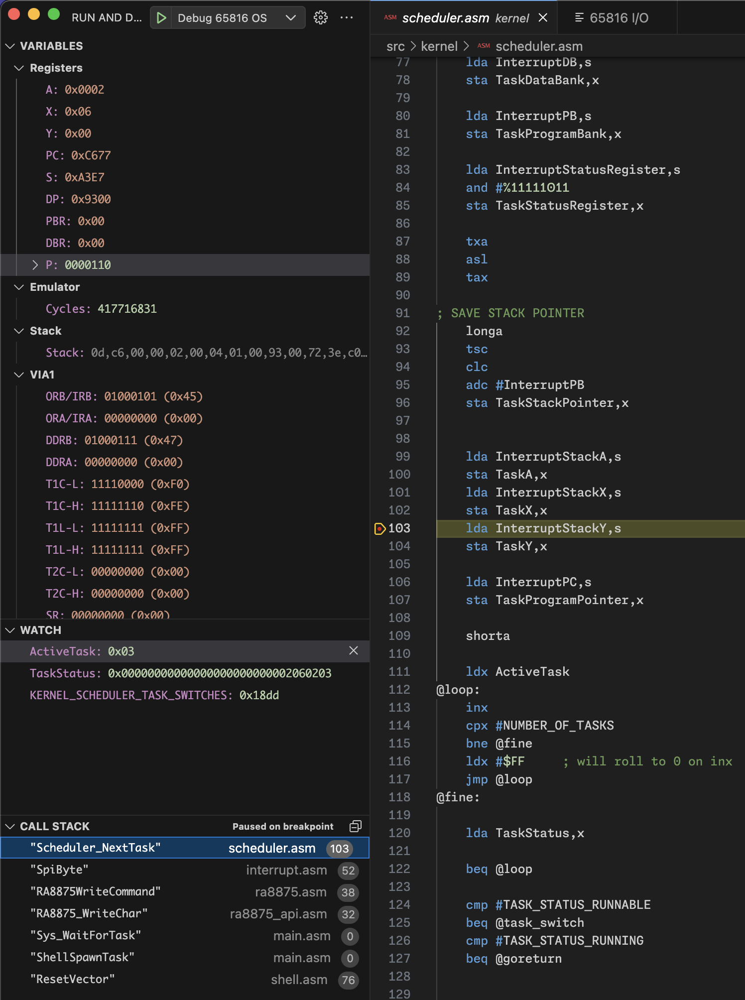
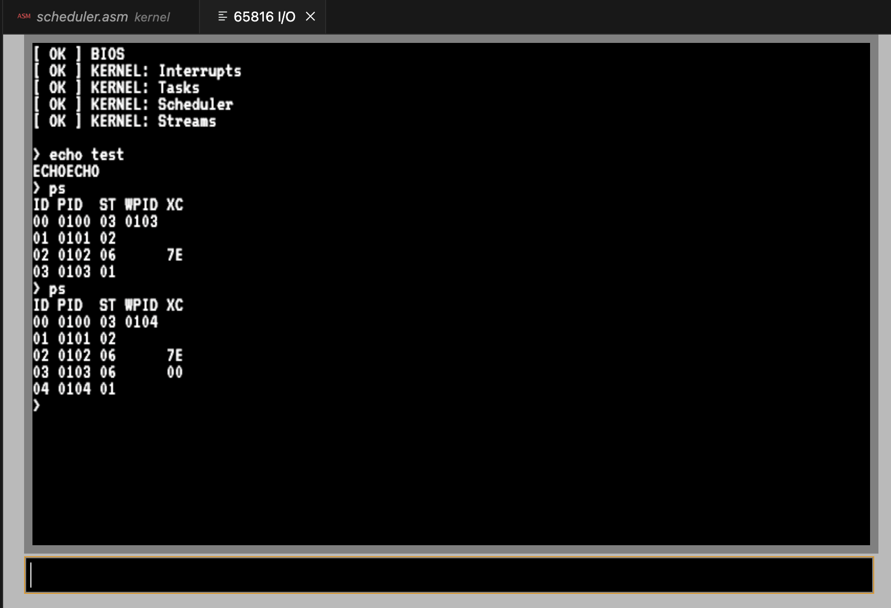

# 65816 OS with vscode debugger + emulator

This is a work-in-progress 65816 OS with a vscode emulator+debugger.
The OS is written in 65816 assembly, the debugger is a vscode extension, and the emulator is written in TypeScript.

The OS was originally developed on my breadboard computer, but I got fed up with reprogramming my EEPROMs for every change I made. Even though I had a serial connection to the computer where I could write debug information I still needed a faster turnaround when developing the OS. So I started developing the emulator and debugger to be able to run the OS on my computer and inspect the internal state of the machine in a breakpoint.

This is a life-long personal project that I work on when real life allows and motivation permits. I do not expect anyone to understand any of this, but I am happy to answer questions.

Maybe it can be an inspiration for someone else wanting to do something similar.

## OS

The [OS](os/src) is a multi-tasking OS with a preemptive scheduler. It is assembled with the ca65 assembler. Here are some of the features of the OS:

- [Preemptive scheduler](os/src/kernel/scheduler.asm)
- [SPI driver](os/src/bios/drivers/spi/spi.asm) (VIA6522)
- [PS/2 keyboard driver](os/src/bios/drivers/keyboard/keyboard.asm) (SPI)
- [RA8875 display driver](os/src/bios/drivers/ra8875/ra8875.asm) (SPI)
- [USB245R serial](os/src/bios/drivers/usb245r/usb245r.asm) (VIA6522)
- [Shell](os/src/programs/shell.asm) that can spawn tasks

The scheduler works by being triggered by an interrupt from the VIA6522 timer. It then saves the current task registers (all of them) in memory and loads the next task registers. It then switches the direct page to the new task's area for it. This means each task has their own direct page and can write to it as if they were the only code running on the machine.

This direct page reloaction is the reason I stopped my 6502 OS which had to use memory mapping to switch between tasks. It was not easy. Much more elegant on the 65816.

A few programs are included in the OS. The most important is the shell which acts as task 0. It can spawn other tasks either in the foreground or in the background by appending a `&` to the command. Another programs is `ps` which prints out the currently running tasks and the stopped tasks. I want to be able to write new programs in C and have them use the stdlib and kernel from the OS.

There is no memory safety in the OS and there will not be. So each program has to behave nicely.

What am I working on:

- Numbered streams (where stdin and stdout are hardcoded)
- Using streams for tasks so they can be redirected to other tasks
- Being able to compile C code to 65816 assembly supported by my machine

What I want to add in the future:

- Scrolling on the RA8875 (really needed)
- File system
- Networking (TCP/IP)

## Emulator

The [emulator](vscode65816/src/lib) is written in TypeScript and lives alongside the debugger as they are (too) tightly coupled at the moment.

The emulator implements the actual hardware for my specific 65816 breadboard computer, including the RA8875 display. The debugger shows this RA8875 in a (beautiful) webview.

Most of the work is the [CPU.ts](vscode65816/src/lib/CPU.ts) of course which handles all the opcodes. It is just a lot of different changes in the registers. It is all tied together with the [System.ts](vscode65816/src/lib/System.ts) file that builds up the computer.

## Debugger

The [debugger](vscode65816/src/mockDebug.ts) is a vscode extension. It is a mess since it was copied from the vscode "Mock" debugger example. There is still some code left that is not used. Most of the changes are the integration with the emulator. Where the debug actions are applied to the emulator.

The biggest challenge for the debugger was to translate between the running assembly code and the original source files. This is done by looking in the dbg file generated by the ca65 assembler. It then somehow [creates a map](vscode65816/src/mockDebug.ts#766) between every memory location to the originating source file. And another map from source files to memory locations. To this day I cannot remember how I wrote that code and in hindsight I should have written a lot more comments. But it works!

Features of the debugger:

- Shows the RA8875 display in a webview
- Keyboard input in the webview as well
- Breakpoints
- Callstacks (using labels in the source files) (not working 100% with inferring the depth. But is can get there)
- Registers
- VIA6522 registers
- Watch labels (it will find the memory location and size of the label)

### Screenshots

Breakpoint inspecting the internals of the computer:

The RA8875 display in a webview:

## Hardware

The breadboard computer that the OS is written for is running stable at 12MHz. It uses SPI to talk with a PS/2 keyboard and a RA8875 display. It also has a USB245R serial connection for debugging. I do most of the new development in the emulator and debugger and then once in a while I flash the EEPROMs and test it on the real hardware.

# How to run the debugger

You need to have the ca65 and tools in your path. Probably also npm to to run the vscode extension.

This involves two steps. 1. Debug/run the vscode extension. 2. Debug/run the 65816 emulator.

Open the repository in vscode. You will see a Debug task called "Debug 65816 Extension". Press the play button to start vscode with the extension installed.

You might need to click "Debug Anyway" if you have not installed some needed problem-matchers. It still works.

In this new vscode instance the workspace will be the "os" folder with the 65816 assembly code.'
Choose the debug task: "Debug 65816 OS". This will launch the 65816 emulator.
Now you can debug the 65816 assembler code. Pause, breakpoint, expect memory, etc.

Try typing `ps` to run the ps program which prints out the currently running tasks and the stopped tasks.
